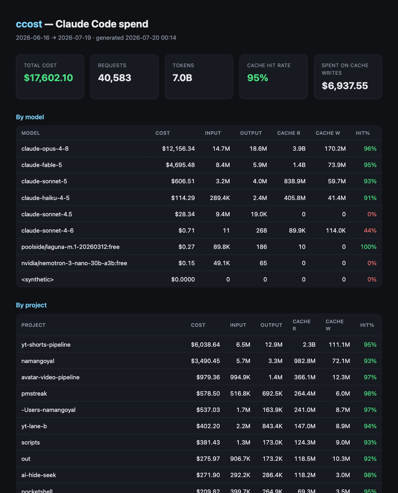

<h1 align="center">ccost</h1>

<p align="center">
  <b>See what Claude Code actually costs you.</b><br>
  A fast, zero-config CLI that turns your local Claude Code logs into a beautiful cost &amp; usage report —<br>
  daily, monthly, per-project, per-model — and shows you the <b>cache waste</b> nobody else surfaces.
</p>

<p align="center">
  <code>uvx --from git+https://github.com/namangoyal3/ccost ccost</code>
</p>

<p align="center">
  <a href="#install">Install</a> ·
  <a href="#what-you-get">What you get</a> ·
  <a href="#the-cache-angle">The cache angle</a> ·
  <a href="#commands">Commands</a> ·
  <a href="#pricing">Pricing</a>
</p>

<p align="center"></p>

<p align="center"><sub><code>ccost html</code> writes a shareable, self-contained report like this.</sub></p>

---

Claude Code writes a JSONL log for every session under `~/.claude/projects/`. Those files
already know exactly how many tokens you burned, on which model, in which project. `ccost`
reads them locally, prices them, and tells you where your money went. Nothing is uploaded.

```text
╭──────────────── ccost · Claude Code spend ────────────────╮
│ Total cost   $17,600.37                                    │
│ Requests     40,577                                        │
│ Tokens       7.0B                                          │
│ Period       2026-06-16 → 2026-07-19  (33d, $533.34/day)   │
╰───────────────────────────────────────────────────────────╯
╭───────────────────── Cache economics ─────────────────────╮
│ Cache hit rate   95%                                       │
│ Spent writing cache   $6,937.33  (39% of total)            │
│ Healthy reuse — you're getting cache back at 0.1x.         │
╰───────────────────────────────────────────────────────────╯
                          By model
┃ Model              ┃       Cost ┃ Cache R ┃ Cache W ┃ Hit% ┃
┡━━━━━━━━━━━━━━━━━━━━╇━━━━━━━━━━━━╇━━━━━━━━━╇━━━━━━━━━╇━━━━━━┩
│ claude-opus-4-8    │ $12,154.65 │    3.9B │  170.2M │  96% │
│ claude-fable-5     │  $4,695.48 │    1.4B │   73.9M │  95% │
│ claude-sonnet-5    │    $606.51 │  838.9M │   59.7M │  93% │
│ claude-haiku-4-5   │    $114.25 │  405.6M │   41.4M │  91% │
                      By project (top 5)
┃ Project               ┃      Cost ┃ Cache R ┃ Cache W ┃ Hit% ┃
┡━━━━━━━━━━━━━━━━━━━━━━━╇━━━━━━━━━━━╇━━━━━━━━━╇━━━━━━━━━╇━━━━━━┩
│ yt-shorts-pipeline    │ $6,038.64 │    2.3B │  111.1M │  95% │
│ namangoyal            │ $3,490.45 │  982.8M │   72.1M │  93% │
│ avatar-video-pipeline │   $979.36 │  366.1M │   12.3M │  97% │
│ pmstreak              │   $578.50 │  264.4M │    6.0M │  98% │
│ ai-hide-seek          │   $271.90 │  118.2M │    3.0M │  98% │
```

<sub>Real output from ~5,800 sessions. On a Max/Pro plan these are equivalent-API-value
estimates, not billed dollars — that number is the leverage your subscription is giving you.</sub>

## Install

`ccost` runs with [`uv`](https://docs.astral.sh/uv/) — no clone, no virtualenv:

```bash
# one-off run
uvx --from git+https://github.com/namangoyal3/ccost ccost

# install as a persistent tool
uv tool install git+https://github.com/namangoyal3/ccost
ccost
```

Or with pip:

```bash
pip install git+https://github.com/namangoyal3/ccost
```

## What you get

- **Total spend** across every session, priced per model with real Anthropic rates.
- **By model** — where Opus/Sonnet/Haiku each land on your bill.
- **By project** — which repo is quietly burning the most.
- **Daily / monthly** trends with a `$/day` burn rate.
- **An HTML report** you can share: `ccost html`.
- **JSON** for piping into anything else: `ccost json`.

## The cache angle

Claude Code's cost is dominated by **prompt caching**, and most tools ignore it. Cache
*writes* cost 1.25–2× the input rate; cache *reads* cost only 0.1×. So your bill hinges on
one number: **how often you reuse cached context instead of rebuilding it.**

`ccost` computes your **cache hit rate** and the exact dollars spent creating cache entries.
A low hit rate means long gaps between turns are expiring the 5-minute cache and you're
*re-paying* to rebuild context you already had. That's a knob you can turn — and `ccost` is
the only reader that shows you the knob.

## Commands

| Command | Shows |
|---|---|
| `ccost` | Headline summary + cache economics + model/project breakdown |
| `ccost daily` | Cost per day |
| `ccost monthly` | Cost per month |
| `ccost projects` | Cost per project |
| `ccost models` | Cost per model |
| `ccost html` | Write a shareable `ccost-report.html` |
| `ccost json` | Dump every priced record as JSON |

Flags: `--days N` (last N days), `--dir PATH` (custom log dir), `--pricing file.json`
(override rates), `-o FILE` (html output path).

## Pricing

Prices are USD per million tokens, standard tier, baked in from Anthropic's public pricing.
Cache rates use Anthropic's documented multipliers of the base input rate (read 0.10×,
5-minute write 1.25×, 1-hour write 2.00×). **These are local estimates, not your billed
amount** — Max/Pro plans are flat-rate, and prices drift. Override anything:

```bash
ccost --pricing my-prices.json
```

```json
{ "opus": { "input": 15, "output": 75 }, "sonnet": { "input": 3, "output": 15 } }
```

Models with no public rate (e.g. experimental ones) are priced by best estimate and marked
with `*` in the report.

## How it works

1. Walk `~/.claude/projects/**/*.jsonl` (respects `CLAUDE_CONFIG_DIR`).
2. Pull `message.usage` from each assistant turn.
3. Dedupe by message + request id — resumed sessions replay old turns.
4. Price each record cache-aware, aggregate, render.

Pure local reads. No network. ~600 lines of Python.

## License

MIT
